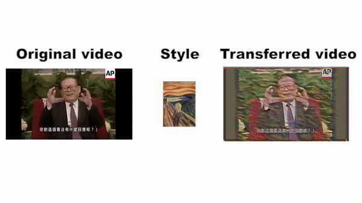

# ECE285sp19-FishTouchers-Project

## Description
This is project Style Transfer developed by team FishTouchers composed of
<ul>
  <li><strong>Changhan Ge</strong>, University of California, San Diego</li>
  <li><strong>Yifan Huang</strong>, University of California, San Diego</li>
  <li><strong>Song Wang</strong>,   University of California, San Diego</li>
  <li><strong>Jingqi Huang</strong>, University of California, San Diego</li>
</ul>

## Requirements
Install packages as follow: torch, torchvision, PIL, collections, pylab, Matplotlib, opencv-python, glob, natsort

## Code organzation
### Codes
demo.ipynb                        --  Run a demo on a trained transformation network (You can change the 'style' or 'content' strings in the code to vary the content/style images)  
video_style_transfer_demo.ipynb-- Run a demo on real-time video style transfer network.  
Part_A_NeuralStyleTransfer.ipynb  --  Gytes' style transfer network training program. 
Part_B_RealTimeTransfer.ipynb     --  Feifei's real-time style transfer network training program. 
trans_net.py                      --  Define the transformation network architecture.  
vgg.py                        --  Define the loss network architecture for the Part_A_NeuralStyleTransfer.ipynb.  

### Files
<strong>Demo-frog-3.mp4</strong>  --  <strong>Style transferred video mentioned in report Sec.4.5.</strong> 
Models                            --  A collection of trained transformation networks. 
images                            --  A collection of style/content images. The style images correspond to the trained networks in Models. You can choose different content images in demo.ipynb to check the transferred result. 
